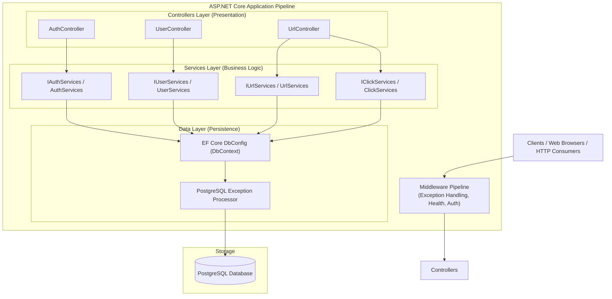
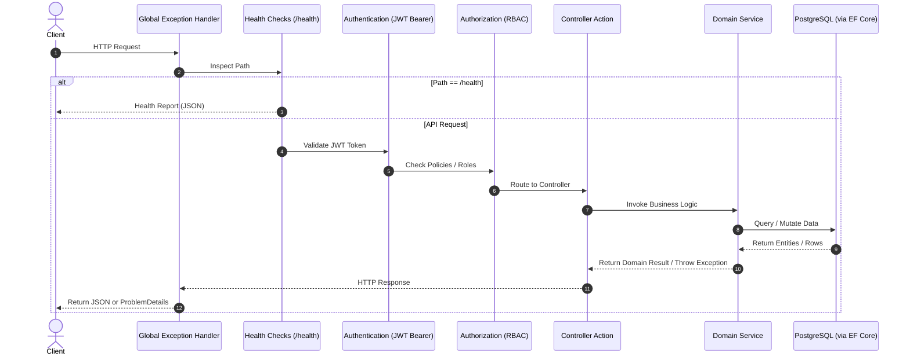
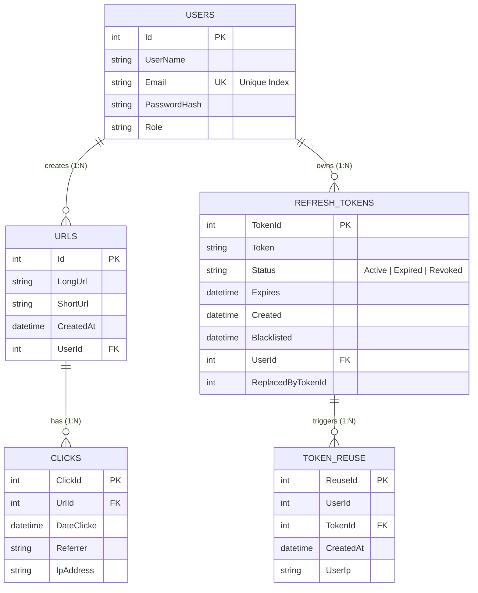
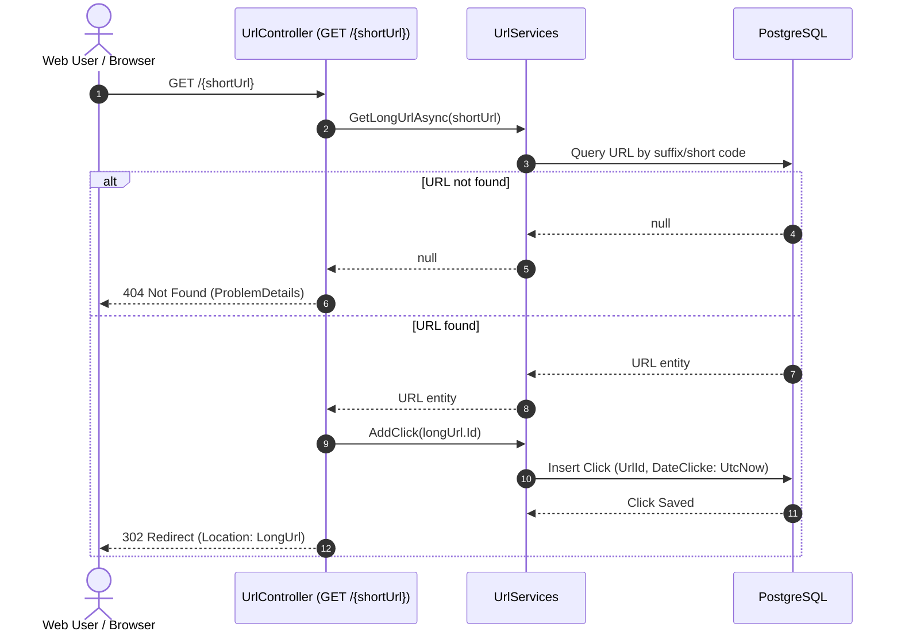

# System Architecture

This document describes the architectural design, layered patterns, data flow, and components of the **URL Shortener API**.

---

## 1. High-Level Architectural Pattern

The application adopts a **Layered (N-Tier) Architecture** built on ASP.NET Core:

---

## 2. Layer Responsibilities

### Presentation Layer (`Controllers/`)
- Handles incoming HTTP requests and binds payload into strongly typed DTOs.
- Validates model states using `System.ComponentModel.DataAnnotations`.
- Enforces role-based authentication attributes (`[Authorize]`, `[Authorize(Roles = "Admin")]`).
- Extracts authenticated user claims (`ClaimTypes.NameIdentifier`) from JWT claims.
- Maps internal service results to HTTP status codes (`200 OK`, `204 NoContent`, `302 Redirect`, `401 Unauthorized`, `404 NotFound`, etc.).

### Business Logic Layer (`Services/`)
- Implements interface contracts (`IAuthServices`, `IUserServices`, `IUrlServices`, `IClickServices`).
- Implements URL shortening algorithms with collision prevention and validation.
- Orchestrates password hashing (`PasswordHasher<User>`) and JWT token lifecycle.
- Manages refresh token rotation and tracks token reuse security events.
- Employs domain exceptions (`NotFoundException`, `ConflictException`, `BadRequestException`, `UnauthorizedException`) instead of returning raw error objects.

### Data Access Layer (`Data/` & `Models/`)
- Configures Entity Framework Core `DbContext` (`DbConfig`).
- Implements relationship configurations (`OnModelCreating`) with cascade deletes.
- Leverages `EntityFrameworkCore.Exceptions.PostgreSQL` to intercept database constraint violations at the EF Core level and transform them into typed exceptions before reaching application layers.

---

## 3. Request Processing Middleware Pipeline

The pipeline is registered in [`Program.cs`](file:///home/saadm/Data/C#/Url_Shortner/Program.cs):

---

## 4. Entity-Relationship (ER) Architecture

The application defines 5 core entities with cascading relational constraints:

---

## 5. URL Shortening & Resolution Workflow

### 1. Shortening Workflow
1. Client submits target URL (`CreateUrlRequest`).
2. `UrlServices.CheckIfShortUrl` validates that the URL is not already a shortened link on this platform.
3. `UrlServices.Shorten_LongUrls` generates a 10-character random alphanumeric string using `Random.Shared.GetItems` and prefixes the `DOMAIN` environment variable.
4. Entity is persisted to the database associated with the caller's `UserId`.

### 2. Resolution & Analytics Workflow

---

## 6. Dependency Injection Registration Map

| Service Interface | Concrete Implementation | Lifetime | Registration Purpose |
| :--- | :--- | :--- | :--- |
| [`IUrlServices`](file:///home/saadm/Data/C#/Url_Shortner/Services/IUrlServices.cs) | [`UrlServices`](file:///home/saadm/Data/C#/Url_Shortner/Services/UrlServices.cs) | Scoped | Core URL generation, resolution, CRUD, and click dispatch |
| [`IClickServices`](file:///home/saadm/Data/C#/Url_Shortner/Services/IClickServices.cs) | [`ClickServices`](file:///home/saadm/Data/C#/Url_Shortner/Services/ClickServices.cs) | Scoped | Click analytics retrieval |
| [`IUserServices`](file:///home/saadm/Data/C#/Url_Shortner/Services/IUserServices.cs) | [`UserServices`](file:///home/saadm/Data/C#/Url_Shortner/Services/UserServices.cs) | Scoped | User creation, lookup, role management, password hashing |
| [`IAuthServices`](file:///home/saadm/Data/C#/Url_Shortner/Services/IAuthServices.cs) | [`AuthServices`](file:///home/saadm/Data/C#/Url_Shortner/Services/AuthServices.cs) | Scoped | Login, JWT creation, token refresh, reuse detection |
| `IExceptionHandler` | [`GlobalExceptionHandler`](file:///home/saadm/Data/C#/Url_Shortner/Exceptions/GlobalExceptionHandler.cs) | Singleton | Centralized error interceptor & RFC 7807 problem details writer |
| `DbContext` | [`DbConfig`](file:///home/saadm/Data/C#/Url_Shortner/Data/DbConfig.cs) | Scoped | EF Core Database Context for PostgreSQL with exception processor |
