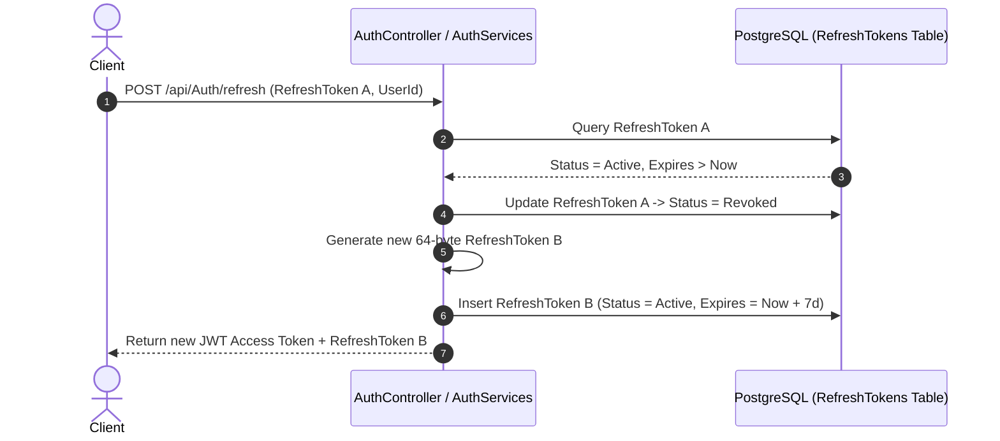
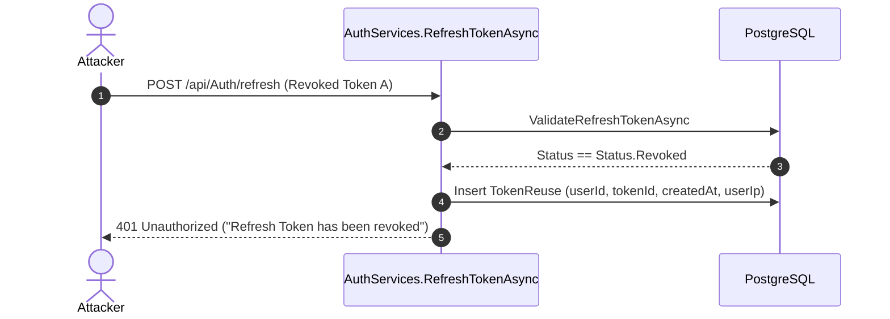

# Authentication & Security Architecture

This document provides an in-depth breakdown of the authentication mechanism, token lifecycle, refresh token rotation, proactive token reuse attack mitigation, and role-based access control (RBAC).

---

## 1. Security Overview

The URL Shortener API utilizes a modern **Dual-Token Authentication Strategy**:
1. **Access Tokens (JWT)**: Short-lived credentials (30 minutes) carrying claims for stateless request authorization.
2. **Refresh Tokens**: Long-lived opaque strings (7 days) stored securely in PostgreSQL, rotated upon every refresh, and monitored for theft/reuse.

---

## 2. Password Hashing

User passwords are encrypted before storage using ASP.NET Core's [`PasswordHasher<User>`](file:///home/saadm/Data/C#/Url_Shortner/Services/UserServices.cs#L25):

- **Algorithm**: PBKDF2 (Password-Based Key Derivation Function 2) with HMAC-SHA256.
- **Salt**: 128-bit cryptographically random salt generated per password.
- **Iteration Count**: Default ASP.NET Core identity iteration count.
- **Verification**: Evaluated via `VerifyHashedPassword(user, hashedPassword, providedPassword)` during login.

---

## 3. JWT Access Token Specifications

Generated in [`AuthServices.CreateToken`](file:///home/saadm/Data/C#/Url_Shortner/Services/AuthServices.cs#L48):

```csharp
var claims = new List<Claim>
{
    new Claim(ClaimTypes.NameIdentifier, user.Id.ToString()),
    new Claim(ClaimTypes.Role, user.Role)
};
```

### Token Properties
- **Algorithm**: HMAC-SHA256 (`SecurityAlgorithms.HmacSha256`)
- **Key Source**: Loaded from `JWT_SECRET_KEY` environment variable.
- **Expiration**: 30 minutes from issuance.
- **Issuer / Audience**: Validated against `ISSUER` and `AUDIENCE` environment configurations.
- **Claims Included**:
  - `ClaimTypes.NameIdentifier` (`sub`): Database user ID (`user.Id`).
  - `ClaimTypes.Role`: Assigned role string (`"Admin"` or `"User"`).

---

## 4. Refresh Token Lifecycle & Rotation

### Generation
- Generated using a cryptographically secure pseudo-random number generator (CSPRNG):
  ```csharp
  string token = Convert.ToBase64String(RandomNumberGenerator.GetBytes(64));
  ```
- Lifespan: **7 days** (`DateTime.UtcNow.AddDays(7)`).
- Initial State: `Status.Active`.

### Token Rotation Flow
Every token refresh request automatically revokes the old token and issues a new active token:



---

## 5. Proactive Token Reuse Detection

Token reuse occurs when an attacker steals a previously used (and therefore revoked) refresh token and attempts to use it.



### Reuse Handling Mechanism:
1. `ValidateRefreshTokenAsync` inspects token status.
2. If `token.status == Status.Revoked`:
   - It invokes `ReuseDetectedAsync(token)`.
   - Creates a record in `ReuseTokens` table with timestamp, `tokenId`, and `userId`.
   - Halts execution and throws an `UnauthorizedException`.

---

## 6. Role-Based Access Control (RBAC)

The application enforces fine-grained authorization via role claims embedded in JWTs:

| Role | Permissions |
| :--- | :--- |
| `User` | - Create and manage own URLs (`/api/Url/myUrls`)<br>- Update own user profile (`/api/User`)<br>- View public endpoints |
| `Admin` | - All `User` permissions<br>- View all system URLs and global click metrics (`GET /api/Url`)<br>- View all registered users in the database (`GET /api/User`) |

### Controller Protection Examples

- **General Authenticated Access**:
  ```csharp
  [Authorize]
  [HttpPost]
  public async Task<ActionResult<URL>> CreateUrl(CreateUrlRequest urlRequest)
  ```

- **Admin Only Access**:
  ```csharp
  [Authorize(Roles = "Admin")]
  [HttpGet]
  public async Task<ActionResult<List<URL>>> GetAllUrls()
  ```
